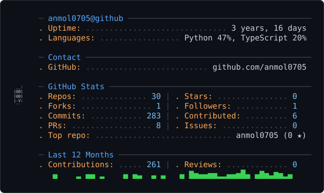

<picture>
  <source media="(prefers-color-scheme: dark)" srcset="dark_mode.svg" />
  <source media="(prefers-color-scheme: light)" srcset="light_mode.svg" />
  
</picture>

---

### Currently

- 🔬 Research Intern under Prof. Sibarama Panigrahi, NIT Rourkela — GNNs + attention models for multi-horizon financial forecasting
- 🏗️ Building production SaaS end to end — multi-tenant systems, real users, real infra decisions
- 🎯 Prepping for SDE-1 placements — DSA, system design, distributed systems
- 🏆 Finalist, Amazon HackOn 6.0 (top 30 of 70,000+)

---

### Engineering, with receipts

| Problem | What I built | Result |
|---|---|---|
| A recurring engineering task took 30–45 min each, by hand | An agentic pipeline combining LLM reasoning, live device control, and a 142,917-edge codebase knowledge graph so it never regenerates code that already exists | **~2 min per task** |
| Every task-visibility check required walking a role hierarchy tree | Materialized permissions into a junction table at task-creation time | **O(1) reads**, not a recursive tree-walk |
| Full-codebase context made LLM calls slow and expensive | Dynamic context selection — only relevant modules go into the prompt | **~80% token reduction** |
| A production SaaS was loading in ~10s from N+1 redundant DB queries | Deduped profile lookups via React `cache()`, merged into one parallel query tier | **~3s page load** |

**One bug worth telling properly:** building a multi-tenant permissions system, I hit infinite recursion — an RLS policy referenced its own table in a subquery, looping Postgres's policy evaluator forever. Fixed with four `SECURITY DEFINER` functions with `search_path` pinned explicitly, which breaks the recursive evaluation loop. Turned into a genuine dive into how Postgres evaluates RLS, not just a syntax fix.

---

### Featured work

| Project | What it is |
|---|---|
| [Fillio](https://github.com/anmol0705/Fillio) | Multi-tenant work-management SaaS for CA firms — real product, used in production. 11-table Postgres schema, 3-layer defense-in-depth security |
| [Claim-Sense](https://github.com/anmol0705/Claim-Sense) | Motor-insurance telematics — architected the on-device AI pipeline (TensorFlow/scikit-learn/ONNX, YOLOv5), led a 4-person team through live-vehicle validation |
| [OpenSource_System](https://github.com/anmol0705/OpenSource_System) | LangGraph mentor agent that guides contributors to fix real GitHub issues themselves via proficiency-calibrated hints |
| [ENHANCE3D](https://github.com/anmol0705/ENHANCE3D) | AI-based 3D-print defect detection — 90% accuracy, 25% fewer errors. Runner-up, HackINNOVISION |
| [ChurnAI](https://github.com/anmol0705/ChurnAI) | Customer churn prediction — F1 0.83, ROC AUC 0.73 on 10K+ records, deployed as a FastAPI + Streamlit service |
| [NOMAD](https://github.com/anmol0705/NOMAD) | Portable, plug-and-play AI dev environment that runs off an external drive — no host installation |

---

### Client work

Freelance builds shipped for real clients — production sites, not demos:

| Project | What it is |
|---|---|
| [Jain Poddar & Co.](https://jainpoddar.co.in/) | Marketing site for a 24-year Chartered Accountancy practice in Ranchi (4 partners, 1000+ clients) |
| [Upasana](https://trustupasana.in/) | Site for a pediatric early-intervention and child-development centre |
| [Vandana / WeGiftForYou](https://vgifts4u.com/) | B2B corporate gifting and office-supplies platform, Bengaluru — clients include HP, L&T Technology Services |
| [TechoBits](https://techobits.com/) | Agency site — web apps, Salesforce, cloud infrastructure, AI systems |
| [ARK Hotels Ranchi](https://www.arkhotelsranchi.in/) | Booking and marketing site for a hotel in Kokar, Ranchi |

---

<!--START_SECTION:activity-->
<!--END_SECTION:activity-->

---

🏆 Amazon HackOn 6.0 Finalist (top 30/70,000+) · AlgoUtsav Runner-Up (top 1%/150+ teams) · Codeforces Specialist ([confirm handle]) · CodeChef 3-Star

 

